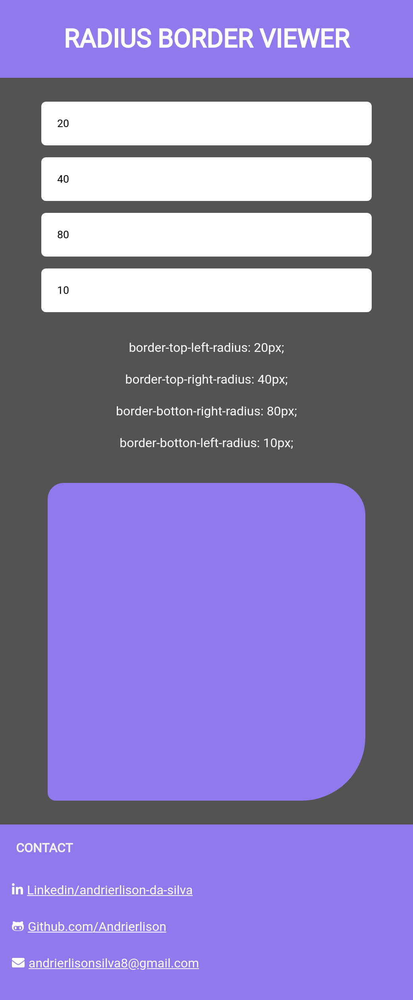

<div align="center">
<h1>
    <a href="https://andrierlison.github.io/radius-border-viewer/">🔗Border Radius Viewer</a>
</h1>

<p>
    <a href="#technologies">Technologies</a> •
    <a href="https://github.com/Andrierlison/radius-border-viewer/blob/master/LICENSE">License</a> •
    <a href="#author">Author</a>
</p>

<h2>Completed project</h2>

<p>
    
</p>
</div>

<h3>Description</h3>
<p>Inspired by the github repository <a href="https://github.com/florinpop17/app-ideas" target="_blank">app-ideas</a> specifically in the Border-Radius-Previewer project.<br />
Through this application the user will type the value in pixels of each corner and can change and view the result of the code in css.</p>

<h3 id="technologies">The following tools were used in the construction of the project:</h3>

- [Html](https://developer.mozilla.org/pt-BR/docs/Web/HTML)
- [Css](https://developer.mozilla.org/pt-BR/docs/Web/Css)
- [Javascript](https://developer.mozilla.org/pt-BR/docs/Web/Javascript)
- [Git](https://git-scm.com/)

<h3>Copy</h3>
<p>You can feel free to copy the page</p>

<p>Before you begin, you will need to have the <a href="https://git-scm.com">Git</a> installed on your machine</p>

<p>In addition, it is good to have an editor to work with the code as <a href="https://code.visualstudio.com/">VSCode</a></p>

<h3>Clone this repository</h3>

```
$ git clone https://github.com/Andrierlison/radius-border-viewer

# Access the project folder in the / cmd terminal

$ cd radius-border-viewer
```

<h3 id="author">Author</h3>

<p>Andrierlison da Silva</p>
<a href="https://www.linkedin.com/in/andrierlison-da-silva-916775190/">🔗Linkedin</a>
<a href="https://github.com/Andrierlison">🔗Github</a>
<a href="mailto:andrierlisonsilva8@gmail.com"><i class="fas fa-envelope"></i>🔗andrierlisonsilva8@gmail.com</a>
